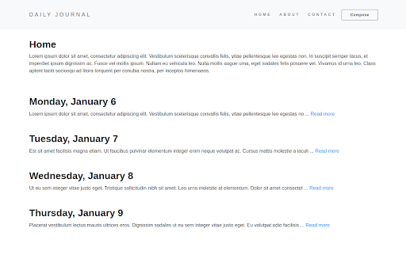

# <div align="center">📔 Daily Journal</div>

#####



<p align="center">A plain daily journal blog 📔</p>

## 🛠️ Technologies

<ul>
  <li><a href="https://ejs.co/">EJS</a></li>
  <li><a href="https://www.mongodb.com/">MongoDB</a></li>
  <li><a href="https://mongoosejs.com/">Mongoose</a></li>
</ul>

## ⚙️ Requirements

<ul>
  <li><a href="https://nodejs.org/en/">Node.js</a></li>
  <li><a href="https://www.npmjs.com/">NPM</a></li>
  <li><a href="https://www.mongodb.com/cloud/atlas">MongoDB Atlas Cluster</a></li>
</ul>

## 🚀 Installation

```
$ git clone https://github.com/gabrielsanttana/daily-journal
```

Before running the app, it's necessary to have a database setup on a MongoDB Atlas Cluster. With that, create a `.env` file in the project root and put these keys in environment variables and they'll work on the mongoose connection string.

Example:

```
MONGODB_USERNAME=username
MONGODB_PASSWORD=123456
MONGODB_CLUSTER_URL=cluster0-lfmbb.mongodb.net
```

If you prefer, you can just place your connection string on the `server.js` file:

```
mongoose.connect(`mongodb+srv...`);
```

Then:

```bash
$ cd daily-journal
$ npm install
$ npm start
```

The application will be avaiable in the browser on http://localhost:3000

## ⚖️ License

[MIT License](https://github.com/gabrielsanttana/daily-journal/blob/master/LICENSE)
